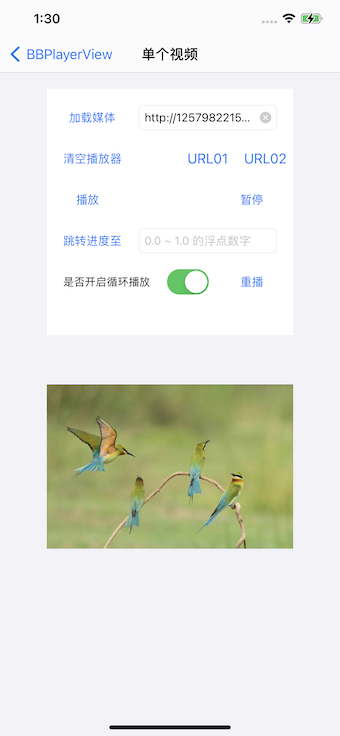

# BBPlayerView
一个高度封装的视频播放器视图，基于 AVPlayer、AVPlayerLayer、AVPlayerItem。
继承自 UIView，可以当做一般视图使用，适用于 Swift 和 Objective-C。
# Example


# Installation
#### Requirements
* Xcode 8 or higher
* iOS 11.0 or higher
* ARC
#### Cocoapods
```
pod 'BBPlayerView'
```
#### Manually
1. 下载 BBPlayerView。
2. 添加 "BBPlayerView/Resource" 文件夹到项目中。
# API
* Delegate
```
@class BBPlayerView;
@protocol BBPlayerViewDelegate <NSObject>
@optional

/**
 播放进度更新回调
 当播放结束后可以决定是否循环播放
 */
- (void)bb_playerView:(nullable BBPlayerView *)playerView progressDidUpdatedAtTime:(CGFloat)currentTime totalTime:(CGFloat)totalTime progress:(CGFloat)progress;

/** 播放状态变化回调 */
- (void)bb_playerView:(nullable BBPlayerView *)playerView statusDidUpdated:(BBPlayerViewStatus)status;

/** 预加载进度回调 */
- (void)bb_playerView:(nullable BBPlayerView *)playerView didPreloadData:(CGFloat)startTime durationTime:(CGFloat)durationTime totalLoadedTime:(CGFloat)totalLoadedTime totalTime:(CGFloat)totalTime;

@end
```
* Class
```
@interface BBPlayerView : UIView

/**
 代理
 通过代理方法可以获取播放状态、播放进度、预加载进度的变化
 ！！！确保在调用 -bb_loadDataWithURL: 方法之前设置代理属性（如果不需要代理则不用设置）！！！
 */
@property (nonatomic, weak, nullable) IBOutlet id <BBPlayerViewDelegate> bb_delegate;

/**
 加载媒体资源或切换媒体资源
 如果新加载的媒体资源 URL 和当前载入的 ULR 相同且播放器处于 BBPlayerViewStatusReadyToPlay 状态，则忽略本次加载操作
 每次真正载入媒体资源时，都会自动调用一次 -bb_release 方法
 */
- (void)bb_loadDataWithURL:(nullable NSString *)url;
/** 清空播放器 */
- (void)bb_release;

/**
 播放
 由于 AVPlayer 的属性 actionAtItemEnd 设置为 AVPlayerActionAtItemEndPause （默认值）
 所以在媒体资源播放结束后 AVPlayer 的 rate 会设为 0.0
 在媒体资源结尾处调用该方法无效（进度不变仍处在 1.0）
 
 注意：在加载某些媒体资源时，播放结束后调用 -bb_play/-bb_pause 方法可能会改变 AVPlayer 的 rate 值为 1.0/0.0
 那么再去调用 -bb_seekToProgress:completionHandler: 方法，可能在跳转成功后处于 播放/暂停 状态
 所以确保媒体资源播放结束后不要调用 -bb_play/-bb_pause 方法
 */
- (void)bb_play;
/** 暂停 */
- (void)bb_pause;

/// 跳转至指定进度。
/// 该方法完成后不会改变播放速率
/// 该方法是异步操作
/// @param progress 指定进度。取值范围：0.0 ~ 1.0
/// @param completionHandler 结束回调。finished 参数：YES 表示跳转完成；NO 表示跳转失败或取消了
- (void)bb_seekToProgress:(CGFloat)progress completionHandler:(void (^ _Nullable)(BOOL finished))completionHandler;

/**
 视频填充模式
 BBPlayerViewGravityScaleFill   -- 填充满视图，可能变形，内容不会缺失
 BBPlayerViewGravityAspectFill  -- 填充满视图，不变形，可能内容缺失
 BBPlayerViewGravityAspectFit   -- 不变形填充视图，直到一个边到达视图边界，内容不会缺失
 */
@property(nonatomic) BBPlayerViewGravity bb_videoGravity;

@end
```
```
@interface BBPlayerViewCellManager : NSObject

@property (class, readonly) BBPlayerViewCellManager *bb_manager;

/**
 添加真实播放视频的 cell
 只在 cell 播放视频时把该 cell 加入到 manager 来管理
 */
- (void)addCell:(id<BBPlayerViewCellManagerDelegate>)cell;

/**
 移除 cell
 在 cell 进入可复用状态调用
 即：在 -prepareForReuse 调用该方法
 */
- (void)removeCell:(id<BBPlayerViewCellManagerDelegate>)cell;

/**
 移除全部 cell
 在列表所在控制器销毁时调用
 即：在 -dealloc 调用该方法
 */
- (void)removeAllCells;

/**
 所有 cell 暂停播放
 指定某个 cell 播放时，其他所有 cell 暂停播放
 */
- (void)pauseAllCellPlayers;

@end
```
# Use
#### 导入文件
* Swift 中在需要引用的地方 
```
import BBPlayerView
```
* Objective-C 中在需要引用的地方
```
#import "BBPlayerView.h"
```
#### 使用说明
BBPlayerView 可以像 UIView 一样代码创建或者在 xib、storyboard 拖拽创建。
详细使用方法请下载项目参考使用示例，包括简单的视频播放和视频列表播放功能。
1. 如果不关心资源加载状态只需两行代码即可实现。
```
[_playerView bb_loadDataWithURL:_URLField.text];
[_playerView bb_play];
```
2. 通过 BBPlayerView 提供的公开方法可以很容易实现：加载播放资源、播放、暂停、重新播放、跳转指定进度、释放资源清空播放器。
3. 视频列表一般会保证只有一个视频在播放，所以要控制 cell 中的播放器在其他 cell 播放时暂停播放。
BBPlayerViewCellManager 就是一个管理视频列表 cell 的管理类。
# 播放状态转移
图片中箭头表示操作或持续操作的结果，矩形表示状态。

# License
BBPlayerView is distributed under the MIT license. See LICENSE file for details.
